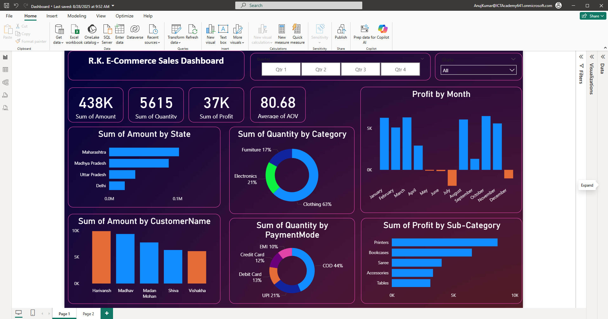
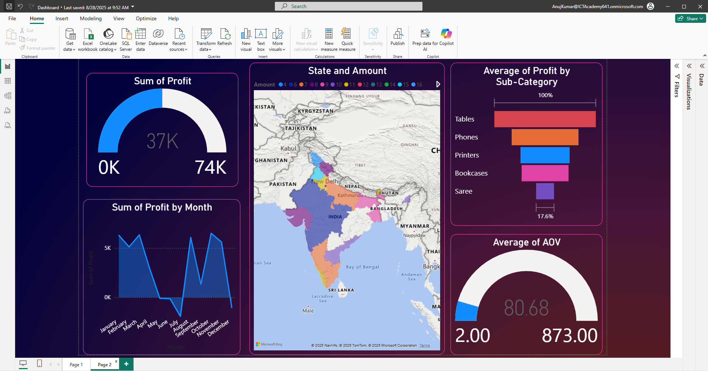

# 📊 R.K. E-Commerce Sales Dashboard (Power BI)

## 📌 Project Overview
This project is an **interactive E-Commerce Sales Dashboard** created in **Power BI** during my Data Analytics internship/training.  
The dashboard provides clear business insights into **sales, profit, customer behavior, and product performance** across different states, categories, and time periods.

---

## 🚀 Features & KPIs
- **Key Metrics (KPIs):**
  - Total Sales Revenue
  - Total Profit
  - Quantity Sold
  - Average Order Value (AOV)

- **Visualizations:**
  - Profit Trends by Month
  - Sales Distribution by State (Map View)
  - Sub-Category Profitability
  - Customer-wise Sales Contribution
  - Payment Mode Distribution (COD, UPI, Debit/Credit, EMI)
  - Category-wise Quantity Sold (Furniture, Electronics, Clothing)

- **Interactivity:**
  - Quarter-wise filters
  - State-wise drill-downs
  - Dynamic charts with slicers

---

## 🛠 Tools & Skills Used
- **Power BI** → Data modeling, DAX basics, KPI creation, dashboard design  
- **Excel/CSV** → Data cleaning, preprocessing, and formatting  
- **Data Analytics Concepts** → Trend analysis, profitability analysis, KPI tracking  

---

## 📂 Repository Contents
- `Dashboard.pbix` → Power BI dashboard file  
- `Details.csv` → Dataset containing customer and sales details  
- `Orders.csv` → Dataset containing order transactions  
- `1.png` / `2.png` → Dashboard screenshots  
- `README.md` → Project documentation  

---

## 📸 Dashboard Preview
### Page 1 – Sales Overview

### Page 2 – Profit & State Analysis

## 📄 PDF Version
[Download Dashboard PDF](Ecommerce_Dashboard.pdf)

---

## 🔑 Key Learnings
- Hands-on practice with **Power BI data modeling** and **visualization design**  
- Creating and tracking **business KPIs** for decision making  
- Improved ability to present insights clearly using dashboards  

---

## 📬 Contact
👤 **Anuj Kumar Jha**  
📍 Faridabad, Haryana, India  
📧 anujjha.dev@gmail.c
